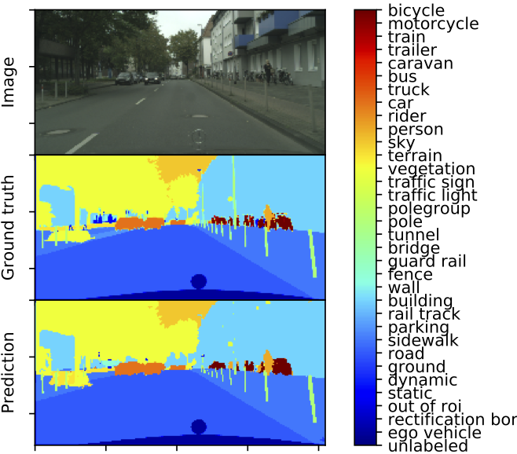
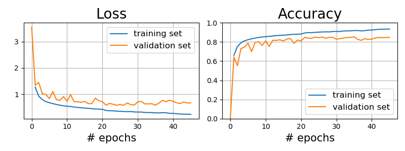
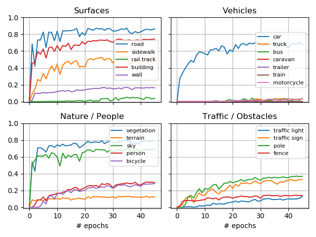
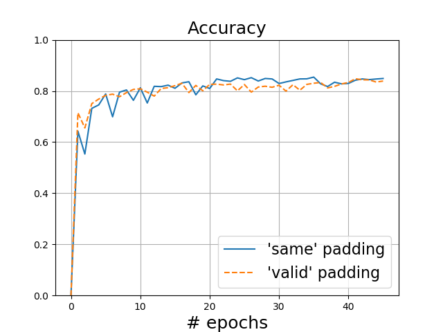

# About

In this project I trained a neural network from scratch to perform semantic segmentation on urban driving scenes. The model was created using Pytorch, and trained on an AWS EC2 instance using 8 GPUs in parallel (the p2.8xlarge instance).

## Dependencies

This project uses Pytorch for training and Torchvision to access the Cityscapes dataset. These can be downloaded using pip, via the following commands:

> pip install torch
>
> pip install torchvision

It also uses matplotlib, numpy, and time, all of which are included in the standard library.

## Dataset

The model was trained on the Cityscapes dataset, which can be downloaded [here](https://www.cityscapes-dataset.com/downloads/) (you'll have to make a free account). Specifically, you need to download the files "gtFine_trainvaltest.zip", "gtCoarse.zip", and "leftImg8bit_trainvaltest.zip". 

If you are training on a remote server (such as an AWS EC2 instance), downloading the dataset can be a bit trickier since you need to login to the website. This can be done using the following shell commands:

> wget --keep-session-cookies --save-cookies=cookies.txt --post-data 'username=USERNAME&password=PASSWORD&submit=Login' https://www.cityscapes-dataset.com/login/

> wget --load-cookies cookies.txt --content-disposition https://www.cityscapes-dataset.com/file-handling/?packageID=1

In the first line, replace USERNAME and PASSWORD with your username and password for the site. In the second line, where it says "packageID=1", replace the last number with 1, 2, and 3 to download the three required datasets mentioned above. Credit goes to [this](https://towardsdatascience.com/download-city-scapes-dataset-with-script-3061f87b20d7) blogpost for the workaround.

## The Model

The model I used for the neural network is based on the famous U-Net architecture ([link](https://arxiv.org/abs/1505.04597)):

I initially started with an exact replica of U-Net but found its results were underwhelming, so I added batch normalization after every convolution layer and it achieved much better performance. The model uses convolution layers and max pooling for downsampling/feature extraction, with ReLU activations. It then uses transposed convolutions (with stride of 2) in order to upsample the network back to its original resolution (approximately). At each upsampling step, the model has a skip connection which concatenates features from a previous layer with the newly upsampled features. 

Note that while the original U-Net architecture used 'valid' padding for its convolutions, I found no signicant difference in performance between padding techniques, so all the results that follow were trained using 'same' padding in order to preserve image size. More info on this can be found in the "Additional Case Studies" section.

## How to Use

### Training

The file trainer.ipynb contains everything to train your own neural network from scratch. The hyperparameters that can be customized are all contained in the first couple cells. I used the Adam optimizer and a pixel-averaged cross-entropy loss function to train the network.

I was having memory issues, so my code actually reduces the resolution by a factor of two when it loads the images. Other than this, the only data augmentation I used was to randomly horizontally flip half the images. You can add additional augmentation methods by editing the Cityscapes class within the dataset.py file. Just make sure you apply identical transforms to both the image and the segmentation label. 

The model was trained on 8 GPUs in parallel using a p2.8xlarge EC2 instance on AWS, and takes roughly ~15 mins per epoch (with batch size of 8) to train. The code automatically lowers the learning rate by a factor of 2 every 10 epochs. I found that the model stops improving after 20 epochs. This comes out to around 5 hours of training if using AWS, or ~$35.

### Testing

If you're either too impatient or don't have the computational resources to train your own model, I provided my pretrained models in the checkpoints folder. You can evaluate the models using the test.ipynb notebook. Here is an example of a predicted segmentation from the validation set, with ground truth label for comparison:

At a glance, it appears to classify most of the image correctly. It struggles with narrower objects, such as the pole on the right (although, in fairness, that one's difficult to see even with the human eye).

## Results/Observations

I tracked two metrics for evaluating my model: (1) a simple pixel-averaged accuracy, and (2) the intersection over union (IoU) for each class. As you can see in the above figure, the pixel accuracy achieved 80%+ after only a few epochs, and then was a slow crawl to ~85% before flattening out around the 20th epoch. Beyond 20 epochs, the training loss continued to decrease while the validation loss remained flat, indicating that the model was being overfit. Note that, other than horizontal image flipping, I made no effort to augment the traininig data, so it's very likely that with data augmentation and/or regularization this model could be trained even further.

The above figure shows the computed intersection over union (IoU) for each class. More common objects tend to have much better IoUs, which makes sense as the network has more training data to learn from. Additionally, smaller objects such as traffic lights, signs, bicycles tend to have worse IoUs, as these classes are impacted more by noise/small variations in boundary estimates. 

Most of the images tend to be dominated by a few classes, such as sky, road, cars, and trees. These classes tend to have fairly simple features, and so the neural network is able to learn what they look like very quickly. This is why the overall pixel accuracy is able to hit 80%+ after only a few epochs, despite the fact that the IoU for most classes remains low. The model then spends the remainder of its training trying to learn the features of the more complex, smaller objects, such as bicycles, people, and street signs. I plan to experiment with a modified loss function, where it gives more weight to classes which make up less pixels in the image, in order to try and encourage the model to prioritize learning the smaller classes more quickly. But I've already burned through a lot of money on my AWS instance, so I'll leave that on my "to do" list for now. :-)

## Additional Case Studies

#### Effects of padding

I found it strange that the original U-Net paper used 'valid' padding in its convolutional layers, as this results in a loss of roughly ~50% of the pixels around the edge of the image. So I performed a unit test where I trained two models. Each model's hyperparameters were exactly identical, except one had valid padding while the other had 'same' padding in order to preserve image size. A comparison of their validation accuracies can be seen below:

As you can see, there is virtually no difference between using valid padding vs same. Therefore I see no reason to use valid padding, as was done in the original U-Net architecture. 

Note that, in light of the above observations, all the previous results shown were from the model trained with 'same' padding.

#### Improving the loss function

Leaving this as a "to do" item for now. I plan to play with the loss function, and see if I can build a custom loss function which is able to prioritize learning smaller objects over things like road, sky, etc. 

## About me

I'm a Physics PhD-turned-data-scientist, with an emphasis on computer vision and deep learning methods. If you have any questions about me, this project, or something else, feel free to reach out:

* [linkedin](https://www.linkedin.com/in/jeffsrobertson/)
